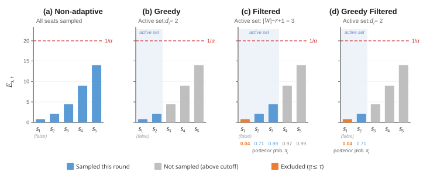
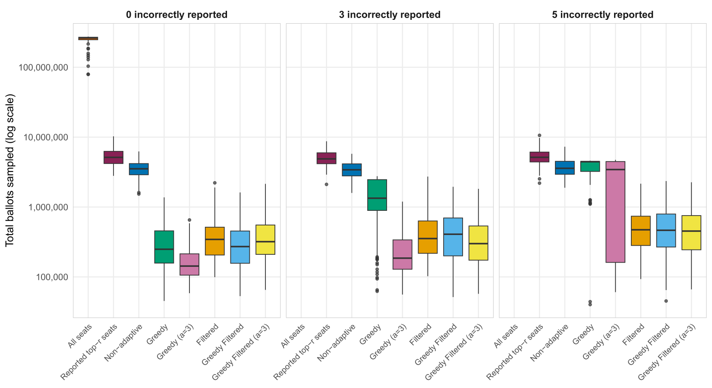
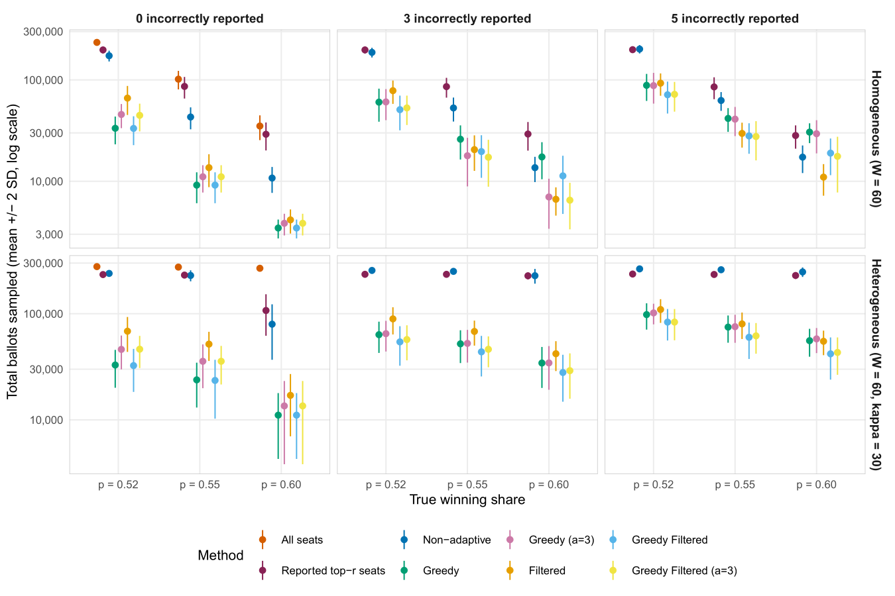

## Overview

TODO

## Acknowledgements :moneybag:

Australian Research Council (ARC):

- OPTIMA ITTC [IC200100009](https://dataportal.arc.gov.au/NCGP/Web/Grant/Grant/IC200100009)

## Parliamentary majorities

```{r}
#| label: example-parliament
library(ggparliament)
library(ggplot2)

election_results_example <- data.frame(
  party = c("A", "B", "C"),
  seats = c(120, 50, 30),
  color = c("blue", "orange", "magenta")
)

parl_data_example <- parliament_data(
  election_data = election_results_example,
  type = "semicircle",
  parl_rows = 7,
  party_seats = election_results_example$seats
)

ggplot(parl_data_example) +
  aes(x = x, y = y, colour = party) +
  geom_parliament_seats(size = 5, show.legend = FALSE) +
  scale_colour_manual(values = election_results_example$color,
                      limits = election_results_example$party) +
  draw_majoritythreshold(n = 100, label = FALSE, type = "semicircle") +
  theme_ggparliament()
```


## Parliamentary majorities

- Standard RLA: certify winner of **every seat** ($s \in \mathcal{S}$)

- New focus: certify a **winning majority** of seats ($r = \left\lfloor \frac{|\mathcal{S}|}{2} \right\rfloor + 1$)

- Pool evidence across seats to reduce total ballot inspections

## The ingredients

::::::::: columns
::::: {.column width="50%"}
::: {.callout-tip icon="false"}
### RLAs of single contests

SHANGRLA, ALPHA,...
:::

. . .

::: {.callout-tip icon="false"}
### Safe, anytime-valid testing

E-processes, test supermartingales,...
:::
:::::

::::: {.column width="50%"}
. . .

::: {.callout-tip icon="false"}
### Partial conjunction testing

Replicability analysis,...
:::

. . .

::: {.callout-tip icon="false"}
### Auditing a parliamentary majority

[Mohanty et al. (2019)](#references), E-Vote-ID 2019
:::
:::::
:::::::::

## Hypothesis testing

Hypotheses:

- $H_0\colon$"reported election outcome is **NOT** correct"
- $H_1\colon$"reported election outcome is correct"

. . .

Observe **all** cast ballots $\rightarrow$ **certainty** about outcome

Observe a random sample $\rightarrow$ statistically infer outcome

. . .

::: callout-tip
## Risk-limiting

Set the desired level of statistical confidence
:::

## Existing RLA tools

. . .

::: {.callout-tip icon="false"}
### SHANGRLA [(Stark 2020)](#references)

- General RLA framework
- Many **electoral systems** (plurality, super-majority, IRV, scoring, etc.)
- Many **auditing styles** (ballot-polling, comparison, stratified, etc.)
- Decomposes everything to *single-dimensional tests*
:::

. . .

::: {.callout-tip icon="false"}
### ALPHA [(Stark 2023)](#references)

- Sequential *single-dimensional tests*
- Flexible, adaptive
:::

## Combining hypotheses

Statements: $$\mathcal{S} = \{S_1, S_2, \dots\}$$

. . .

Example:

- $S_1 =$ Alice beat Bob
- $S_2 =$ Alice beat Charlie
- etc.

. . .

How to test "any" or "all" of these?

## "All"

- $H_0 = \cup_j \bar{S}_j \quad$ "at least one statement is false"
- $H_1 = \cap_j      S_j  \quad$ "**all** statements are true"

. . .

This is a **conjunction**

. . .

Need to reject **all** of the complementary nulls, $\bar{S}_j$

. . .

::: callout-tip
### Example: SHANGRLA

The $S_j$ are called *assertions*
:::

## "Any"

- $H_0 = \cap_j \bar{S}_j \quad$ "all statements are false"
- $H_1 = \cup_j      S_j  \quad$ "**at least one** statement is true"

. . .

This is a **disjunction**

. . .

Need to reject **at least one** of the complementary nulls, $\bar{S}_j$

. . .

::: callout-tip
### Example: AWAIRE

- Used for auditing IRV [(Ek et al., 2023)](#references)
- The $\bar{S}_j$ are called *requirements*
:::

## "Some"

- $H_0\colon$"at least $|\mathcal{S}| - r + 1$ statements are false"
- $H_1\colon$"**at least** $r$ statements are true"

```{r}
#| label: partial-conjuction-diagram
#| fig-width: 10
#| fig-height: 1.5
#| out-width: 100%

library(ggplot2)
library(latex2exp)

# Diagram configuration parameters
total_items <- 16  # Total items in set |S|
r <- 10            # Number of items in group 'r'

# Data frame representing the items in a line
df_items <- data.frame(
  x = 1:total_items,
  y = 0,
  # First r items are filled black, remaining items are hollow white
  fill_group = factor(ifelse(1:total_items <= r, "Group_R", "Group_Remaining"))
)

# Geometry offsets for brackets and text labels
y_dot <- 0
bracket_tick_height <- 0.3 # Vertical tick length for brackets
gap <- 0.48                # Clearance gap between circles and brackets
label_distance <- 0.35     # Gap between bracket and its label

# Bottom bracket parameters (spans x = 1 to x = r)
bottom_y_base  <- y_dot - gap
bottom_y_tip   <- bottom_y_base - bracket_tick_height
bottom_label_y <- bottom_y_tip - label_distance

# Top bracket parameters (spans x = r to x = total_items)
top_y_base  <- y_dot + gap
top_y_tip   <- top_y_base + bracket_tick_height
top_label_y <- top_y_tip + label_distance

p <- ggplot() +
  # 1. Render items as circles (solid for first r, hollow for the rest)
  geom_point(
    data = df_items, 
    aes(x = x, y = y, fill = fill_group), 
    shape = 21, 
    color = "green3", 
    size = 4.5, 
    stroke = 1.2
  ) +
  scale_fill_manual(values = c("Group_R" = "green3", "Group_Remaining" = "white")) +

  # 2. Draw Bottom Bracket [1 to r]
  # Horizontal bar
  annotate("segment", x = 1, xend = r, y = bottom_y_tip,  yend = bottom_y_tip, linewidth = 0.8) +
  # Left tick mark
  annotate("segment", x = 1, xend = 1, y = bottom_y_base, yend = bottom_y_tip, linewidth = 0.8) +
  # Right tick mark
  annotate("segment", x = r, xend = r, y = bottom_y_base, yend = bottom_y_tip, linewidth = 0.8) +
  # Label 'r'
  annotate("text", x = (1 + r) / 2, y = bottom_label_y, label = TeX("$r$"), size = 6) +

  # 3. Draw Top Bracket [r to |S|]
  # Horizontal bar
  annotate("segment", x = r, xend = total_items, y = top_y_tip, yend = top_y_tip, linewidth = 0.8) +
  # Left tick mark
  annotate("segment", x = r, xend = r, y = top_y_base, yend = top_y_tip, linewidth = 0.8) +
  # Right tick mark
  annotate("segment", x = total_items, xend = total_items, y = top_y_base, yend = top_y_tip, linewidth = 0.8) +
  # Label '|S| - r + 1'
  annotate("text", x = (r + total_items) / 2, y = top_label_y, label = TeX("$|S| - r + 1$"), size = 5.5) +

  # 4. Axes & Aspect Ratio Styling
  coord_fixed(ratio = 1) +
  scale_x_continuous(limits = c(0.3, total_items + 0.7)) +
  scale_y_continuous(limits = c(-1.3, 1.3)) +

  # Minimal transparent/clean theme
  theme_void() +
  theme(
    legend.position = "none",
    plot.background = element_rect(fill = "white", color = NA),
    plot.title = element_text(margin = margin(b = 25))
  )

print(p)
```

. . .

This is a **partial conjunction**

. . .

::: callout-tip
### Example: replicability analysis

Used for assessing scientific findings across several studies
:::

## Partial conjunction null

The null can be expressed as:

$$H_0 = H_{r/\mathcal{S}} = \bigcup_{\substack{\mathcal{C} \subset \mathcal{S} : \\ |\mathcal{C}| = |\mathcal{S}| - r + 1}} \bigcap_{j \in \mathcal{C}} \bar{S}_j$$

. . .

We need to reject **all** of the inner intersections: $$H_{1/\mathcal{C}} = \bigcap_{j \in \mathcal{C}} \bar{S}_j$$

. . .

Each is the null of a disjunction ("any")

::: footer
[Benjamini & Heller (2008)](#references)
:::

## Summary of combinations

|   | "Any" | "Some" | "All" |
|------------------|------------------|-------------------|------------------|
| **Type** | Disjunction | Partial conjunction | Conjunction |
| $H_0$ notation | $H_{1/\mathcal{S}}$ | $H_{r/\mathcal{S}}$ | $H_{|\mathcal{S}|/\mathcal{S}}$ |
| $H_1$ meaning | At least 1 | At least $r$ | At least $|\mathcal{S}|$ |

## Parliamentary majority null

Define:

- $\mathcal{S}$, set of all parliamentary seats
- $r$, majority threshold
- $\mathcal{W} \subseteq \mathcal{S}$, seats reportedly won by the winning party ($|\mathcal{W}| \geqslant r$)

. . .

Null hypothesis (partial conjunction): $$H_{r/\mathcal{W}}$$

. . .

"fewer than $r$ seats were truly won by the winning party"

## Testing a null hypothesis, $H_0$

::::: columns
::: {.column width="50%"}
- Risk limit: $\alpha$
- Observations: $X_1, X_2, \dots$
- Test process: $E_1, E_2, \dots$
- $E_t$ is an **e-process**:\
  $E_0 = 1$ and $\mathbb{E}_{H_0}(E_\tau) \leqslant 1$
- Stopping rule:\
  Reject $H_0$ once $E_t \geqslant 1 / \alpha$
- Example: ALPHA
:::

::: {.column width="50%"}
```{r}
#| label: sprt-single-boundary
#| fig-width: 5.5
#| fig-height: 5
#| out-width: "100%"

set.seed(2079)  # 2046 2063 2065

# Parameters for data distribution.
p_true <- 0.6  # true proportions
n <- 62        # maximum sample size

# SPRT settings.
p0 <- 0.5   # null hypothesis
p1 <- 0.7   # alternative hypothesis
a <- 0.05   # type I error

# Simulate data.
x <- rbinom(n, 1, p_true)
y <- cumsum(x)
ns <- 1:n
s <- p1^y * (1 - p1)^(ns - y) / (p0^y * (1 - p0)^(ns - y))
ns <- c(0, ns)
s  <- c(1,  s)

# Boundary.
bound <- 1 / a
cross.i <- which(s >= bound)[1]
cross.x <- ns[cross.i]
cross.y <-  s[cross.i]

# Draw plot.
par(mar = c(4, 4, 1, 2))
plot(ns, s, type = "n", las = 1,
     ylim = range(0, max(s, bound + 1)),
     xlim = c(0, 65),
     xlab = expression("Sample size, " * t),
     ylab = expression("Test process, " * E[t]))
grid()
lines(ns, s, lwd = 2, col = "blue")
abline(h = bound, lty = 2, lwd = 1, col = "magenta")
#points(tail(ns, 1), tail(s, 1), pch = 1, cex = 1.5, lwd = 2, col = "blue")
points(cross.x, cross.y, pch = 19, cex = 1.5, col = "blue")
axis(2, at = 1, las = 1)
axis(4, at = bound, expression(frac(1, alpha)), las = 1, col.axis = "magenta")
```
:::
:::::

## Tests based on e-processes

- $E_t$ should be an **e-process** under $H_0$
- $E_t$ should **grow quickly** under $H_1$

```{r}
#| label: martingales-simulation

set.seed(142)

# Set parameters.
n <- 12  # maximum sample size

# Simulate data.
x0 <- rbinom(n, 1, p0)
x1 <- rbinom(n, 1, p0 * 0.9)
x2 <- rbinom(n, 1, p1)
y0 <- cumsum(x0)
y1 <- cumsum(x1)
y2 <- cumsum(x2)
ns <- 1:n
s0 <- p1^y0 * (1 - p1)^(ns - y0) / (p0^y0 * (1 - p0)^(ns - y0))
s1 <- p1^y1 * (1 - p1)^(ns - y1) / (p0^y1 * (1 - p0)^(ns - y1))
s2 <- p1^y2 * (1 - p1)^(ns - y2) / (p0^y2 * (1 - p0)^(ns - y2))
```

::::: columns
::: {.column width="50%"}
```{r}
#| label: plot-process-h0
#| fig-width: 5
#| fig-height: 3.5
#| out-width: "100%"

par(mar = c(4, 4.5, 2, 1))

plot(ns, s1, type = "n", las = 1,
     xlim = c(0, n + 3),
     ylim = range(0, s1, s2 + 0.5),
     main = expression(E[t] * " under " * H[0]),
     xlab = expression(t),
     ylab = expression("Test process, " * E[t]))
grid()
lines(c(0, ns), c(1, s1), lwd = 2, col = "blue")
points(tail(ns, 1), tail(s1, 1), pch = 19, cex = 1.5, col = "blue")
```
:::

::: {.column width="50%"}
```{r}
#| label: plot-process-h1
#| fig-width: 5
#| fig-height: 3.5
#| out-width: "100%"

par(mar = c(4, 4.5, 2, 1))

plot(ns, s2, type = "n", las = 1,
     xlim = c(0, n + 3),
     ylim = range(0, s1, s2 + 0.5),
     main = expression(E[t] * " under " * H[1]),
     xlab = expression(t),
     ylab = expression("Test process, " * E[t]))
grid()
lines(c(0, ns), c(1, s2), lwd = 2, col = "blue")
points(tail(ns, 1), tail(s2, 1), pch = 19, cex = 1.5, col = "blue")
```
:::
:::::

## Ville's inequality

Let $E_0, E_1, E_2, \dots$ be an e-process.

For any $\alpha > 0$, $$\Pr\left(\max_t (E_t) \geqslant \frac{1}{\alpha}\right) \leqslant \alpha$$

. . .

$\Rightarrow$ risk limit $= \alpha$

## Testing combinations of hypotheses

Statements: $$\mathcal{S} = \{S_1, S_2, \dots\}$$

. . .

Test processes:

- Test $S_j$ with: $E_{j,1}, E_{j,2}, \dots$

. . .

How do we test combinations?

## Testing combinations of hypotheses

Recipes (for nulls):

- union $\rightarrow$ minimum

$$H_0 = \bigcup_j \bar{S}_j \quad \longrightarrow \quad E_t = \min_j E_{j,t}$$

- intersection $\rightarrow$ product (if independent)

$$H_0 = \bigcap_j \bar{S}_j \quad \longrightarrow \quad E_t = \prod_j E_{j,t}$$

## Parliamentary majority test process

Let $E_{s,t}$ be a test process for seat $s$.

. . .

Test process for parliamentary majority $r$: $$E_{r/\mathcal{W},t} = \min_{\substack{\mathcal{C} \subset \mathcal{W} : \\ |\mathcal{C}| = |\mathcal{W}| - r + 1}} \prod_{s \in \mathcal{C}} E_{s,t} = \prod_{s=1}^{|\mathcal{W}|-r+1} E_{(s),t}$$

. . .

$E_{(1),t} \leqslant E_{(2),t} \leqslant \dots$ are the **order statistics** of $E_{s,t}$ at time $t$.

. . .

::: callout-tip
### Risk-limiting

These are all e-processes, Ville's inequality applies. (Theorem 1 in paper)
:::

<!-- TODO: show plots and animations of seat-level processes -->

## E-processes vs. Fisher combination {.smaller}

**Direct e-process combination** (our method)

- Uses fixed, dimension-free threshold $1/\alpha$

. . .

**Previous approach** [(Mohanty et al. 2019)](#references)

- Converted seat e-processes into p-values $P_{s,t} = 1/E_{s,t}$

- Combined p-values using Fisher's method

- Uses threshold $\exp\left(\frac{1}{2}\chi^2_{2k, 1-\alpha}\right)$ for $k = |W| - r + 1$

. . .

- For $\alpha = 0.05$ and $k = 11$ (ten spare seats):

  - E-process threshold is $1/\alpha = 20$

  - Fisher threshold is $\approx 2.3 \times 10^7$, requiring $\sim 5.7\times$ more samples :warning:

## Adaptive sampling strategies

- Do sampling in 'rounds'

- In each round, can choose whether to 'ignore' some seats (do not sample ballots)

- Goal: minimise total ballots sampled

. . .

- Which seats should we sample in each round?

## Adaptive sampling strategies



## 'Straw man' strategies

. . .

**All seats** :chair: :chair: :chair: :chair:

- Certify all reported winning seats (tests $H_{|\mathcal{W}|/\mathcal{W}}$)
- Non-adaptive sampling strategy (always sample)

. . .

**Reported top-**$r$ seats :seat: :seat:

- Greedily focus on the 'best' $r$ seats
- Sample only from the widest $r$ seats based on reported margin
- Switch to the other seats once ballots are exhausted

## Experimental setup {.smaller .scrollable}

::: panel-tabset
### Common settings

- Simulated audits
- 100 replicates per scenario
- Plurality contest for each seat
- Sampling without replacement
- Ballot-polling audit
- Risk limit $\alpha = 0.05$

### Synthetic elections

- 100 seats (majority $r = 51$)

- 60 reported winning seats

- 2 candidates/seat

- 5000 ballots/seat

- Vote shares:

  - Fixed (homogeneous) or beta-distributed (heterogeneous)
  - 0--5 falsely reported seats (set winner's vote share to 48%)

### Indian election

- [2014 Indian Lok Sabha](https://en.wikipedia.org/wiki/16th_Lok_Sabha) (lower house)
- 543 seats (majority $r = 272$)
- 282 reported winning seats
- 5--43 candidates/seat
- 87 k -- 1.5 million ballots/seat
- 282 million total ballots
- Injected 0--5 falsely reported seats (swap with runner-up)
:::

## Indian election

```{r}
#| label: indian-parliament
library(ggparliament)
library(ggplot2)

# Define election results.
election_results <- data.frame(
  party = c("BJP", "INC", "AIADMK", "Others"),
  seats = c(282, 44, 37, 180),
  color = c("#FF9933", "#19AAED", "#008000", "#C9C9C9")
)

# Compute coordinate locations for a 10-row semicircle hemicycle.
parl_data <- parliament_data(
  election_data = election_results,
  type = "semicircle",
  parl_rows = 10,
  party_seats = election_results$seats
)

# Render diagram using ggplot2.
ggplot(parl_data) +
  aes(x = x, y = y, colour = party) +
  geom_parliament_seats(size = 5, show.legend = FALSE) +
  scale_colour_manual(values = election_results$color,
                      limits = election_results$party) +
  draw_majoritythreshold(n = 272, label = FALSE, type = "semicircle") +
  theme_ggparliament()
```

## Indian election



## Practical considerations {.smaller}

- **Need coalition info ahead of time**

  - Method not useable if parties create coalitions **after** the election.

. . .

- **'Midstream' certification**

  - Can run an all-seats audit in tandem
  - The parliamentary majority will certify first.

. . .

- **Large-batch sampling**

  - Audits can be done in a large-batch rounds
  - Our methods still apply.

. . .

- **Comparison audits**

  - Can use other audit designs
  - If SHANGRLA-compatible, our methods apply.

## Summary {.smaller}

- Partial conjunction framework enables certifying a majority

- Efficient: up to **1,000**$\times$ reduction in ballot inspections on a real-world national election dataset

- Flexible: allows different audit styles and sampling designs

. . .

**Future directions**:

- Improved sampling designs and test process tuning

- Use reported info (margins)

- Determine optimal sample sizes for large-batch rounds

# Questions?

## Download {.smaller}

Slides :desktop_computer: <https://dvukcevic.github.io/rla-majorities-evoteid2026/>

Paper :bookmark_tabs: <https://arxiv.org/abs/2607.21082>

Software :minidisc: <https://github.com/freejstone/RLA_parliamentary_majorities_code>


## References :books: {#references .smaller}

- Benjamini, Heller (2008). [Screening for partial conjunction hypotheses](https://doi.org/10.1111/j.1541-0420.2007.00984.x). *Biometrics* 64(4):1215-1222.

- Ek, Stark, Stuckey, Vukcevic (2023). [Adaptively weighted audits of instant-runoff voting elections: AWAIRE](https://doi.org/10.1007/978-3-031-43756-4_3). In: Electronic Voting. E-Vote-ID 2023. *Lecture Notes in Computer Science* 14230:35--51.

- Mohanty, Culnane, Stark, Teague (2019). [Auditing Indian elections](https://doi.org/10.1007/978-3-030-30625-0_10). In: Electronic Voting. E-Vote-ID 2019. *Lecture Notes in Computer Science* 11759:150--165.

- Stark (2020). [Sets of half-average nulls generate risk-limiting audits: SHANGRLA](https://doi.org/10.1007/978-3-030-54455-3_23). In: Financial Cryptography and Data Security. FC 2020. *Lecture Notes in Computer Science* 12063:319--336.

- Stark (2023). [ALPHA: Audit that learns from previously hand-audited ballots](https://doi.org/10.1214/22-AOAS1646). *Ann. Appl. Stat.* 17(1):641--679.

# Appendix

## Seat-level e-processes via SHANGRLA {.smaller}

- Using SHANGRLA, seat contest $s$ is decomposed into $J_s$ assorter means.
- $H_s$ is false if $\bar{x}_{s,j} > 1/2$ for all $j \in \{1, \dots, J_s\}$.
- For each assertion, construct an ALPHA betting process $M_{s,j,t}$:

$$M_{s,j,t} = \prod_{i=1}^{n_s(t)} \left(1 + \lambda_{s,j,i}(X_{s,j,i} - \mu_{s,j,i})\right)$$

- **Seat e-process**: $E_{s,t} = \min_{1 \leqslant j \leqslant J_s} M_{s,j,t}$.
- Guaranteed **anytime-valid** via Ville's inequality: $\Pr(\sup_{t \geqslant 0} E_{s,t} \geqslant 1/\alpha) \leqslant \alpha$.

::: notes
At the individual seat level, we leverage the SHANGRLA framework and ALPHA betting supermartingales. Each seat $s$ gets a non-negative test process $E_{s,t}$ that measures the evidence accumulated against the null hypothesis $H_s$. Ville's inequality guarantees that these statistics are anytime-valid under continuous sequential sampling.
:::

## Posterior filtering of unpromising seats {.smaller}

### Dirichlet-Multinomial Bayesian model

- Model ballot counts per seat via Bayesian conjugate updating
- Compute posterior probability $\pi_s$ that seat $s$ was truly won:

$$\pi_s = \min_j \Pr(\theta_{s,j} > 1/2 \mid \mathcal{F}_t)$$

### Filter rule

- Exclude seat $s$ from sampling if $\pi_s \leqslant \tau$ (we used $\tau = 0.01$)
- Prunes unpromising or corrupted seats early, redirecting audit capacity to legitimate winning seats.

::: notes
To overcome the greedy trap, we introduce a Bayesian filtering layer. Using a Dirichlet-Multinomial conjugate model, we track the posterior probability $\pi_s$ that the reported winner actually won. If $\pi_s$ drops below 1%, we filter that seat out and stop wasting ballots on it.
:::

## Synthetic elections


